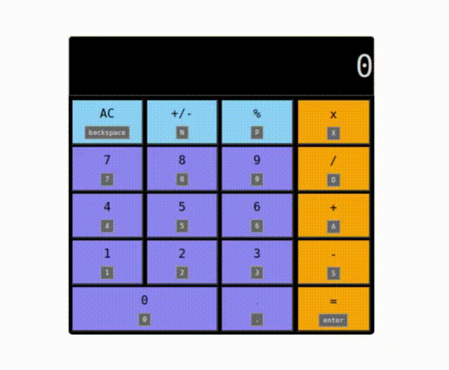

# javascript-calculator
 odin-javascript-calculator is a basic front-end calculator application built with Javascript and is used to calculate basic mathematical operations

 <h3>View Live: https://jvben76.github.io/odin-js-calculator/</h3>
  
  <h3>Instructions, demo and controls below...</h3>
  

> 
>
>
> # How to Use
>- Clicking on this <a href = "https://jvben76.github.io/odin-js-calculator/">link</a> or the 'View Live' link above will open this calculator app in your browser
>- Click any operand / operator button or tap its corresponding key on your keyboard to input an operand/operator
>- Screen will display the current operand but does not display operators
>- Use calculator buttons to turn numbers into decimals, percentages or negative numbers and to multiply, divide, add, subtract or find the remainder of an expression
>- You can string multiple calculations together as the result of the last operation acts as the first operand of the next 
> -- CLicking an operator in place of clicking '=' will set the result of the previous operation as the first operand of a new operation and the operator being selected as an operator to the new operation 
> --CLicking '=' will display the result of the current operation and will set this result as the first operand in a new operation
>- Make negative numbers by clicking the '+/-' button
>- Turn buttons into percentages by clicking the '%' button
>- Turn numbers into decimal numbers by clicking the '.' button
>- Reset the calculator by clicking the AC button
>
> 
>
>
>
> 
>
>
># keyboard inputs:
>
>  NUMBERS
>- number . &nbsp; :&nbsp; <kbd style = "background-color: black">.</kbd>
>- number 0 &nbsp;:&nbsp; <kbd style = "background-color: black">0</kbd>
>- number 1 &nbsp;:&nbsp; <kbd style = "background-color: black">1</kbd>
>- number 2 &nbsp;:&nbsp; <kbd style = "background-color: black">2</kbd>
>- number 3 &nbsp;:&nbsp; <kbd style = "background-color: black">3</kbd>
>- number 4 &nbsp;:&nbsp; <kbd style = "background-color: black">4</kbd>
>- number 5 &nbsp;:&nbsp; <kbd style = "background-color: black">5</kbd>
>- number 6 &nbsp;:&nbsp; <kbd style = "background-color: black">6</kbd>
>- number 7 &nbsp;:&nbsp; <kbd style = "background-color: black">7</kbd>
>- number 8 &nbsp;:&nbsp; <kbd style = "background-color: black">8</kbd>
>- number 9 &nbsp;:&nbsp; <kbd style = "background-color: black">9</kbd> 
> style = "background-color: black"
>  OPERATORS
>- operator x &nbsp;:&nbsp; <kbd style = "background-color: black">X</kbd>
>- operator / &nbsp;:&nbsp; <kbd style = "background-color: black">D</kbd>
>- operator + &nbsp;:&nbsp; <kbd style = "background-color: black">A</kbd>
>- operator - &nbsp;:&nbsp; <kbd style = "background-color: black">S</kbd>
>- operator = &nbsp;:&nbsp; <kbd style = "background-color: black">enter</kbd>
>
>  FUNCTIONS
>- function AC  &nbsp;:&nbsp; <kbd style = "background-color: black">backspace</kbd>
>- function %  &nbsp;:&nbsp; <kbd style = "background-color: black">P</kbd>
>- function +/-  &nbsp;:&nbsp; <kbd style = "background-color: black">N</kbd>
>
>
> 
>
>
